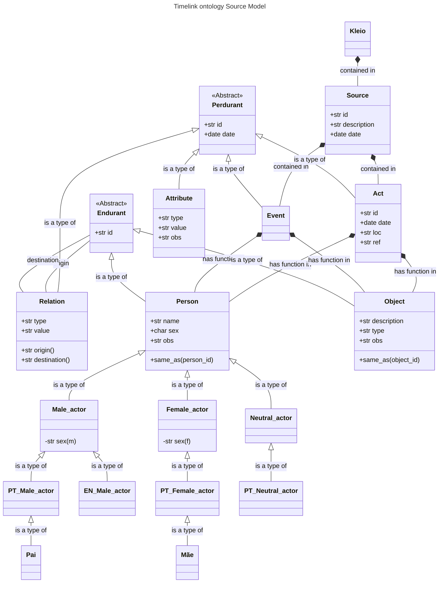

```mermaid
---
title: Timelink ontology Source Model
---
classDiagram
    Kleio *-- Source: contained in
    Source *-- Act: contained in
    Source *-- Event: contained in
    Perdurant <|-- Act: is a type of
    Perdurant <|-- Event: is a type of
    Perdurant <|-- Attribute: is a type of
    Perdurant <|-- Relation: is a type of
    Act *-- Person: has function in
    Act *-- Object: has function in
    Event *-- Person: has function in
    Event *-- Object: has function in
	class Source{
		+str id
		+str description
		+date date}
	class Act{
		+str id
		+date date
		+str loc
		+str ref}
	class Endurant{
		<<Abstract>>
		+str id}
	class Perdurant{
		<<Abstract>>
		+str id
		+date date}
	class Person{
		+str name
		+char sex
		+str obs
		+same_as(person_id)}
    class Object{
        +str description
        +str type
        +str obs
        +same_as(object_id)
        
    }
    class Attribute{
        +str type
        +str value
        +str obs
    }
    class Relation{
        +str type
        +str value
        +str origin()
        +str destination()
    }
    Endurant -- Relation: origin
    Endurant -- Relation: destination
    Endurant <|-- Person: is a type of
    Endurant <|-- Object: is a type of
	Person <|-- Male_actor: is a type of
	Person <|-- Female_actor: is a type of
	Person <|-- Neutral_actor: is a type of
	class Male_actor{
		-str sex(m)
	}
	class Female_actor{
		-str sex(f)
	}
	Male_actor <|-- PT_Male_actor: is a type of
	Male_actor <|-- EN_Male_actor: is a type of
	Female_actor <|-- PT_Female_actor: is a type of
	Neutral_actor <|-- PT_Neutral_actor: is a type of
	PT_Male_actor <|-- Pai: is a type of
	PT_Female_actor <|-- Mãe: is a type of
	
	
	
	
	
	
```
