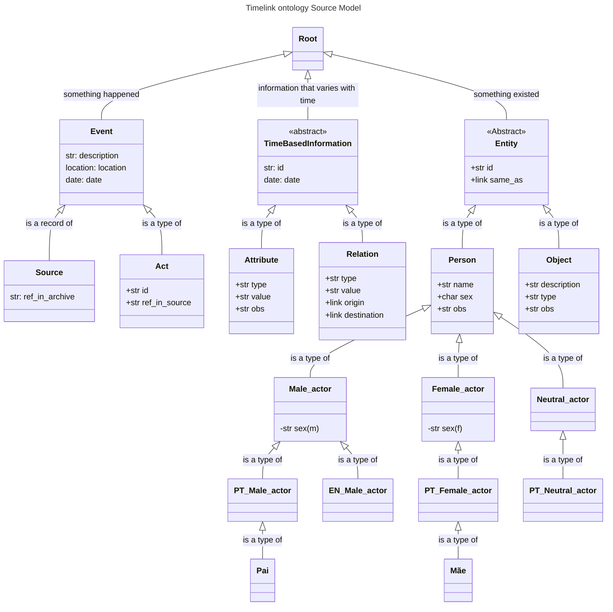
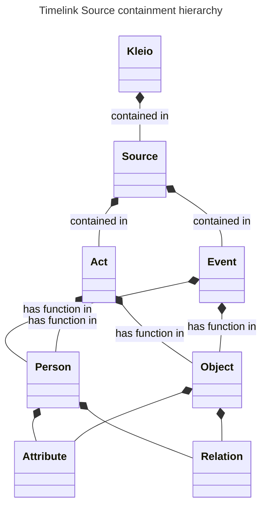

Questões em aberto:
- Isto é ontologia do Source Model ou a Ontologia *tout-court* ? 
- Onde estão as real-entities?
- Onde estão as geo-entities?
- Porque estão aqui os male-actor, female-actor, etc... isso não é ontologia, é artefacto para a transcrição de fonte. Esta parte está mal conceptualizada. 

### Bibliografia a ler

- [ ] Spyns, P., Meersman, R., & Jarrar, M. (2002). Data modelling versus ontology engineering. _ACM SIGMOD Record_, _31_(4), 12–17. [https://doi.org/10.1145/637411.637413](https://doi.org/10.1145/637411.637413)
- [ ] Johansson, I. (2005). _Qualities, Quantities, and the Endurant-Perdurant Distinction in Top-Level Ontologies._ (p. 550). PDF Zotero
- [ ] Krieger, H.-U., & Declerck, T. (sem data). _An OWL Ontology for Biographical Knowledge. Representing Time-Dependent Factual Knowledge_. PDF Zotero
- [ ] Huang, C.-R. (sem data). _Endurant vs Perdurant: Ontological Motivation for Language Variations_. 11.
- [ ] Poveda Villalón, M. (2016). _Ontology Evaluation: A pitfall-based approach to ontology diagnosis_ [PhD Thesis, Universidad Politécnica de Madrid]. [https://doi.org/10.20868/UPM.thesis.39448](https://doi.org/10.20868/UPM.thesis.39448)
- [ ] _Geonames ontology in OWL - GSWB_. (2008, fevereiro 12). [https://web.archive.org/web/20080212144050/http://www.geospatialsemanticweb.com/2006/10/14/geonames-ontology-in-owl](https://web.archive.org/web/20080212144050/http://www.geospatialsemanticweb.com/2006/10/14/geonames-ontology-in-owl)
- [ ] Niles, I., & Pease, A. (2001). _Towards a standard upper ontology_. _2001_, 2–9. [https://doi.org/10.1145/505168.505170](https://doi.org/10.1145/505168.505170)

## Containment hierarchy (not an ontology)

