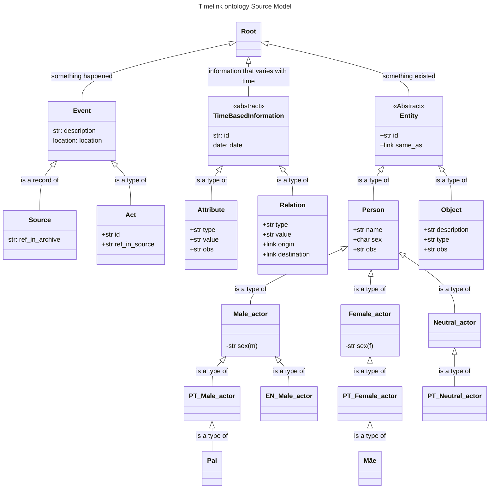
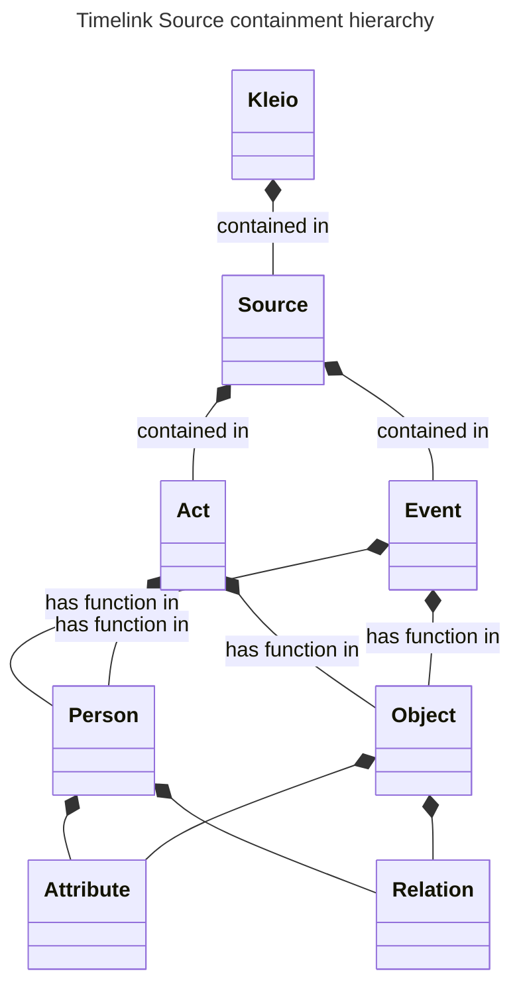

```mermaid
---
title: Timelink ontology Source Model
---
classDiagram
    Root <|-- Event: something happened
    Root <|-- Entity: something existed
    Root <|-- TimeBasedInformation: information that varies with time
    Event <|-- Source: is a record of
    Event <|-- Act: is a type of
    TimeBasedInformation <|-- Attribute: is a type of
    TimeBasedInformation <|-- Relation: is a type of
    
    class Entity{
	    <<Abstract>>
	    +str id
	    +link same_as
	    }
	class TimeBasedInformation{
		<<abstract>>
		str: id
		date: date
		}
	class Event{
		str: description
		location: location
	    }
	class Source{
		str: ref_in_archive
		}
	class Act{
		+str id
		+str ref_in_source}
	class Person{
		+str name
		+char sex
		+str obs
	}
    class Object{
        +str description
        +str type
        +str obs
    }
    class Attribute{
        +str type
        +str value
        +str obs
    }
    class Relation{
        +str type
        +str value
        +link origin
        +link destination
    }
    Entity <|-- Person: is a type of
    Entity <|-- Object: is a type of
	Person <|-- Male_actor: is a type of
	Person <|-- Female_actor: is a type of
	Person <|-- Neutral_actor: is a type of
	class Male_actor{
		-str sex(m)
	}
	class Female_actor{
		-str sex(f)
	}
	Male_actor <|-- PT_Male_actor: is a type of
	Male_actor <|-- EN_Male_actor: is a type of
	Female_actor <|-- PT_Female_actor: is a type of
	Neutral_actor <|-- PT_Neutral_actor: is a type of
	PT_Male_actor <|-- Pai: is a type of
	PT_Female_actor <|-- Mãe: is a type of
```

```mermaid
---
title: Timelink Source containment hierarchy
---
classDiagram
	
    Kleio *-- Source: contained in
    Source *-- Act: contained in
    Source *-- Event: contained in
    Act *-- Object: has function in
    Event *-- Person: has function in
    Act *-- Person: has function in
    Event *-- Object: has function in
    Person *-- Attribute
    Person *-- Relation
    Object *-- Attribute
	Object *-- Relation
	
	
	
	
	
```
