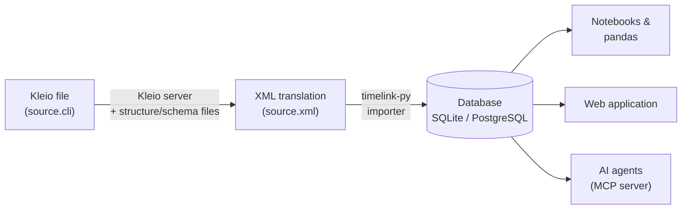

# How Timelink works: from source to database

Timelink keeps historical information in **two complementary
representations**, and moves data between them with a well-defined
pipeline:

* the **source-oriented representation** — transcription files written
  in [Kleio notation](../reference/kleio_notation_reference.md), where
  the text of the source is king and information stays organized the
  way the source itself is organized;
* the **person-oriented representation** — a relational database
  (SQLite or PostgreSQL), where the same information is normalized
  into [entities, attributes and relations](timelink_database.md) so
  it can be searched, counted and linked.

Nothing is retyped on the way: the same fact (a baptism, a name, a
residence) is *translated* from one representation to the other by
software, keeping a pointer back to the exact line of the source it
came from.

## The pipeline

1. **Transcription.** The historian transcribes the source into a
   Kleio file (extension `.cli`), using the
   [Kleio notation](../reference/kleio_notation_reference.md). Groups
   in the file follow a **structure** (a schema) that describes the
   source type — parish baptisms, chronologies, bibliographic
   repertoires…
2. **Translation.** The **Kleio server** (a SWI-Prolog service, run in
   Docker) reads the `.cli` file together with the applicable
   structure files (YAML, in the project's `structures/` directory)
   and produces an **XML file** — a neutral, database-ready rendering
   of the source. Errors and warnings are written to a report file
   (`.rpt`) next to the source.
3. **Import.** The `timelink` Python package reads the XML and loads
   it into the database: every group becomes an
   [entity](timelink_database.md) (person, act, source…), with its
   attributes, relations and provenance (file, line, position).
4. **Exploration.** The database is then explored with Python
   notebooks (pandas data frames), the web application, or AI agents
   through the Timelink MCP server.

## Files you will meet

| File | Produced by | What it is |
|---|---|---|
| `sources/**.cli` | you | transcription in Kleio notation |
| `structures/*.str.yaml` | you | structure (schema) files for source types |
| `sources/**.xml` | Kleio server | translation of the `.cli`, input to the importer |
| `sources/**.rpt` | Kleio server | translation report: errors and warnings |
| `database/sqlite/*.sqlite` | importer | the database (or PostgreSQL instead) |

All of these live inside the project directory — see
[Timelink home](../reference/timelink_home.md) for the layouts.

## Why this design

* **The source stays authoritative.** The database can be rebuilt from
  the sources at any time; when a transcription is corrected, only the
  affected files are re-translated and re-imported (see
  [Processing new versions of sources](../reference/processing_new_versions_of_sources.md)).
* **Record linking is late and reversible.** The same historical
  person appears once per source, with a different id in each.
  Consolidation happens *after* import, through identifications —
  never by merging rows.
* **Provenance is never lost.** Every database row knows which file,
  line and group produced it, so any query result can be traced back
  to the source text.

The next pages describe each stage in practice:
[transcribing sources](../tutorial/processing_source_transcriptions/transcribing_a_source.md),
[translating and importing](../tutorial/processing_source_transcriptions/translating.md),
and [exploring the database](../tutorial/working_with_notebooks/working_with_pandas.md).
