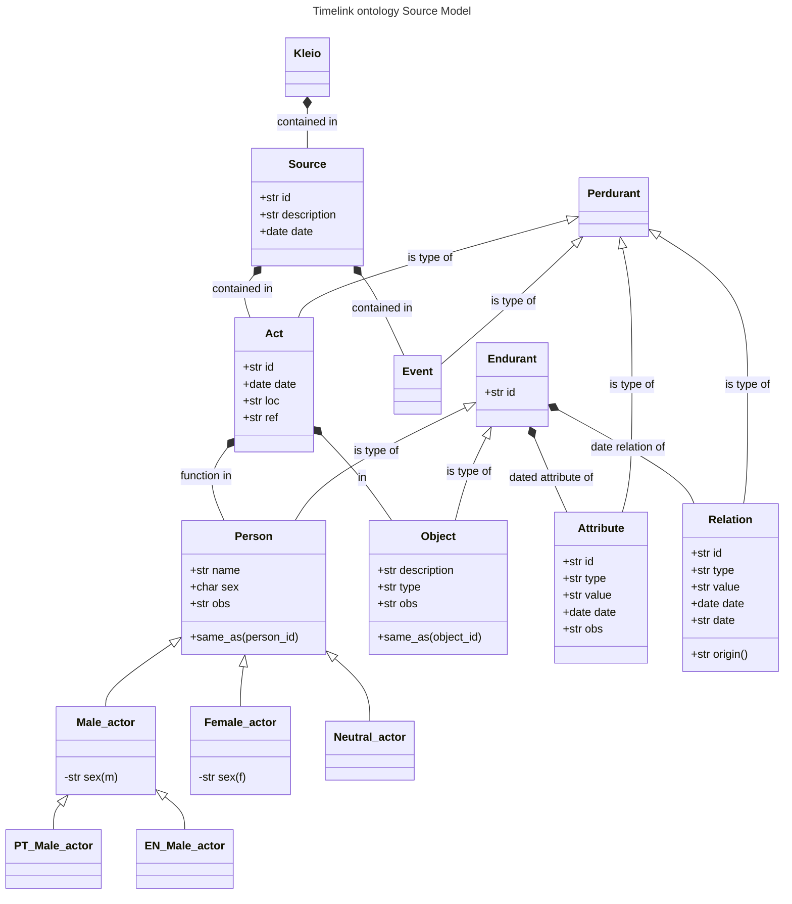

The data model is based on the concept that a historical source contains information on a sequence of nested entities. 

Although there is an infinite variety of historical sources, here we focus on those that contain information about people and objects, or abstractions (like institutions or ideas) and events in which those people participate. 

Typical case is parish registers or notarial records. In those cases the source is a written registration of an event.

