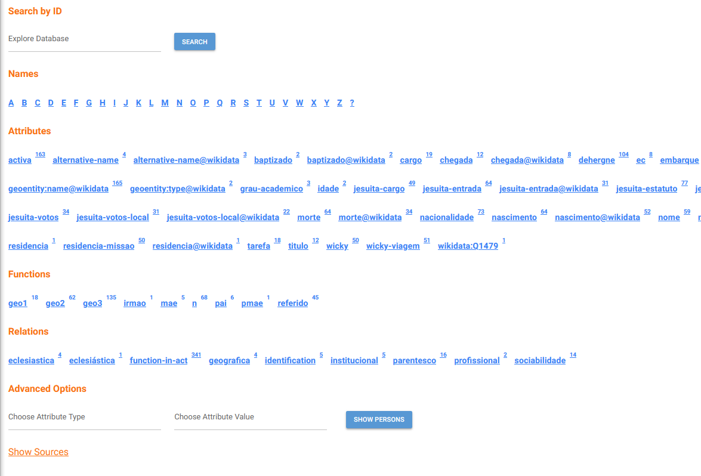

# Explore

This page provides a quick way to view the different attributes, functions and relations within the database, with the option to jump to anything within it immediately.

## Features

### Search by ID
Directly search for an entity's ID, loading its page if the entity is found within the project.

---

### Names

All the names of people starting with the selected letter.

---

### Attributes

Shows all unique attribute types found across the database.

Each one displays:
- the attribute name  
- the total number of values for that attribute  

Clicking the name will show all the different values for the attribute, while clicking the number shows all entries with said attribute in their entry.

---

### Functions

Similar to attributes, but for function values.  

---

### Relations

Lists relation types (like links between people, acts, places, etc.). Functionally the same as function/attribute displays.

---

### Advanced Search

Directly search for a specified attribute type - value combination to filter results faster.

---

## Show Sources

Shows all sources that have been imported in the currently browsed project.

---

### [Back to Page Index](inside_app.md)