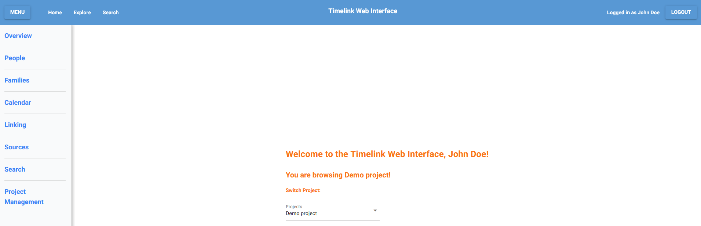

# Inside the App

When a user is successfully logged in he is presented with the homepage, displaying the current project they are logged into, and giving the option to switch to another if the user so wishes.

From here, the user can explore any of the following pages:

- [Overview](overview_page.md)
- [Explore](explore_page)
- [Search](search_page.md)
- [Sources](sources_page)
- [Project Management](management_page.md)
- App Admin (if logged as the ***superuser***) (see [introductory page](login.md))

---

### Next: [Roadmap](web_roadmap)