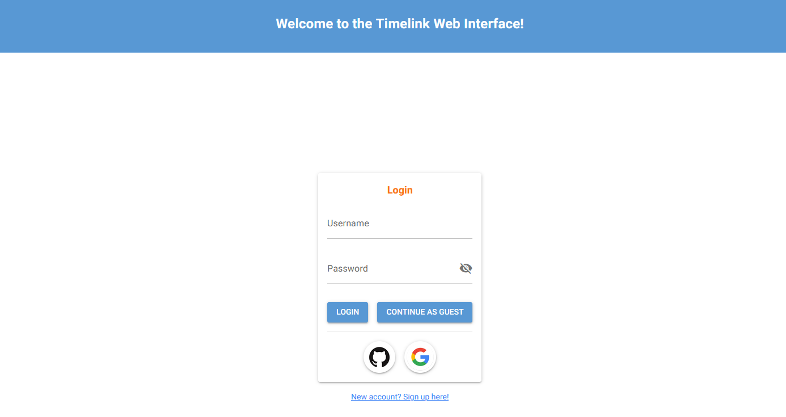

# Timelink Web Interface

Timelink features a web interface with interactive functionality as an alternative to console and/or notebook commands.

## Starting the web app

To start the web interface, one can use the following command:

    timelink start web [-p port] [-d directory] [-db database]

Timelink will then attach to a running Kleio Server if it finds one, or starts a new one if it doesn't. It will also initialize a container running a light installation of Apache Solr that will be used for indexing documents into a core specified in the project structure.

*Note that Docker MUST be running for the application to successfully launch.*

### Optional arguments

    -p, --port

The localhost port that the app will run on, defaults to 8000.

    -d, --directory

The directory the app will start on - this is useful when we want the server to launch under a different timelink project directory than the one we are on. Default is current directory.

    -db, --database

Database choice to run the project on. Either *sqlite* or *postgres*, defaults to SQLite.

Once the command is execute a new browser window with the Web Interface's Login Page should be visible and thus navigated:

---

### Next: [Getting Started](login.md)