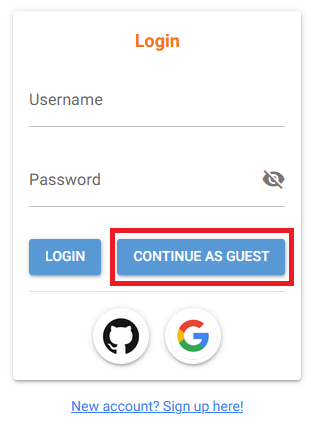
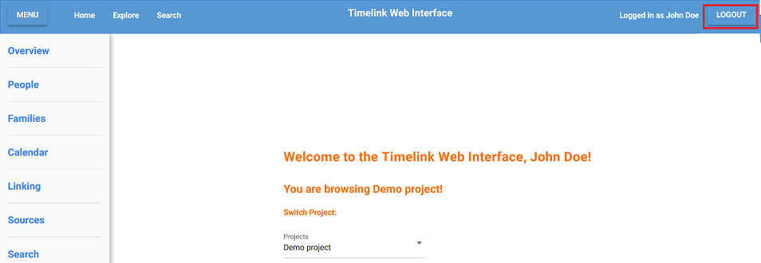
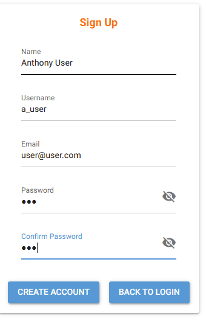
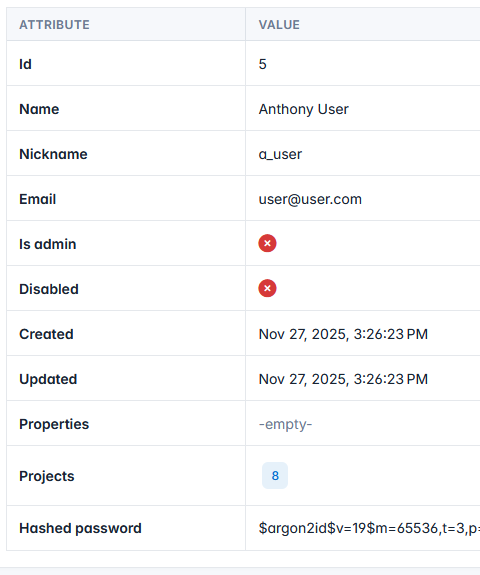
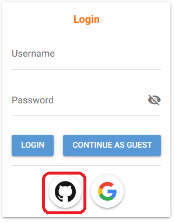

# Getting Started

When you first launch the Timelink Web Interface, a few things happen:

- The databases are set up, and a new Demo Project that is tied to them is created.
- Two users are added to the database: a local superuser "*Admin*" and a "*guest*". These two people are attached to the Demo Project and are used as a jumpstart for the rest of the app setup.

### Logging in as a guest

To view the application and explore its features as a guest, simply click the "*Continue as Guest*" button to be logged into the Demo Project as a guest. From here you are free to explore the database as you wish. 

You can log out at any time using the Logout button at the top corner of the app too.

### Logging in as an admin

To log in as the admin superuser input the following:
- Username: ***Admin***
- Password: ***adminpass***

The admin has an additional option in the left-hand side of the menu: **App Admin**. 

From here, one has complete control over the user database, and can manage anything: projects, current users, user project acess, and user roles in each project.

This is useful to configure which user belongs to each project, as well as project details such as which core should it use, where to connect to the Kleio Server, and which database should be used, among other things.

## Registering New Users

New users can be added to the database and assigned to projects via the Admin panel. There are, however, other ways to add people to the database.

New users can be registered into the database in two ways:

### Standard Sign-Up

By clicking the button to sign up, and filling the necessary information, a user is added to the database, and associated with the first Demo Project. 

The user can then be added to other projects and assigned different roles via the admin panel as normal.

### Sign-Up Via Github

If one has a Github account, they can login using the very same account by pressing the Github icon on the login page. This will redirect the user to the Github Authentication page to confirm if the user's profile can be extracted and added to the database as a new user, if he so wishes. From then on, clicking the button will simply redirect them to the homepage where they can immediately start browsing available projects.

---

### Next: [Inside the App](inside_app.md)
