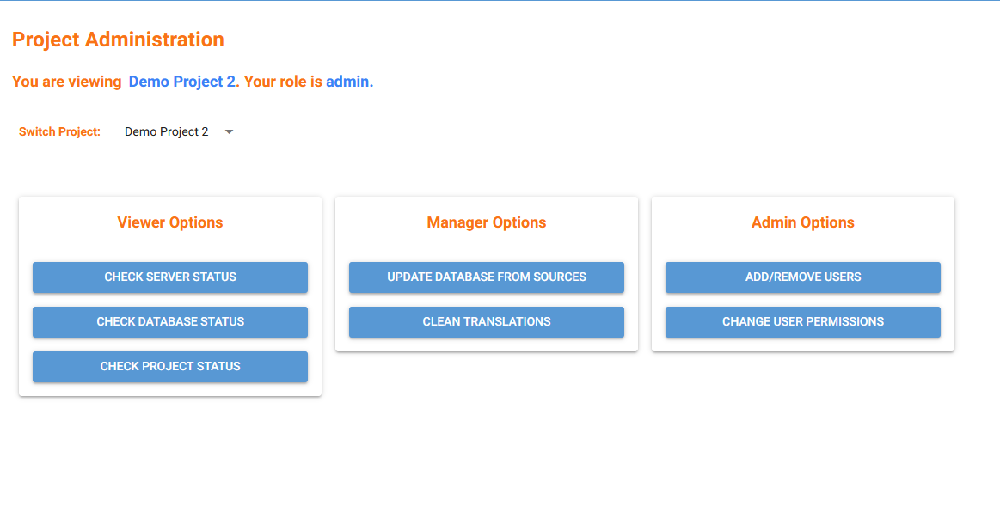

# Project Management Page

This page acts as a control center for managing projects, users, and system utilities. It gives each user a view of their current project, what permissions they have, and what actions they’re allowed to take.

---

## Overview

When the page loads, it shows:
- The **current project** the user is working in  
- The user’s **role** within that project  
- A **project selector** that lets them switch to any project they have access to.

Based on the user’s role, different sets of tools appear. The page organizes these into three categories: viewer tools, manager tools, and admin tools.

---

## Viewer Tools

These options are visible to *any* project member:
- Check the **server status** - *Kleio URL* and *Home*
- Inspect the **database** - Row count for each entity type.
- View **project metadata** - ID, Name, Database, Core, etc...

These are read-only tools meant to help understand what’s going on inside the system.

---

## Manager Tools

If the user has manager or admin permissions, additional actions appear:

- **Update database from sources** - Runs a coroutine in the background to fetch available sources from the Kleio server and import found entities into the database.
- **Clean translations** - Wipes out translations.

These actions modify underlying project data and are therefore restricted to users with the appropriate roles.

---

## Admin Tools

Admins get full project management abilities, which includes the ability to manage other users. An admin can:

- Add or remove users from the project  
- Change user roles within the project.

---

### [Back to Page Index](inside_app.md)