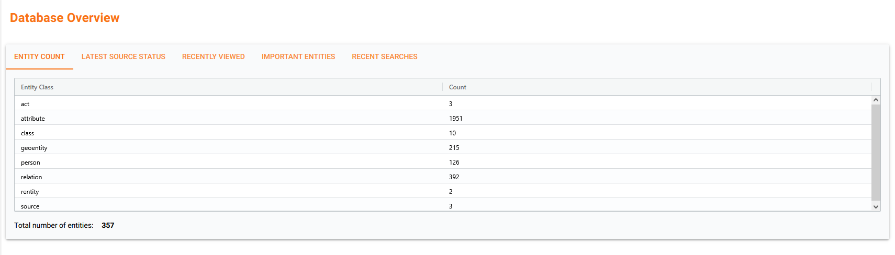

# Overview

The Overview page provides a quick snapshot of what’s happening across the database. It gathers useful information, recent activity, and navigation shortcuts into a single place, making it easy to monitor data, explore recent changes, and jump directly to items of interest.

### Overview Tabs

#### Entity Count

This tab displays how many items exist for each major class in the current database.

#### Latest Source Status

See imported sources, when they were added, and whether they produced any warnings or errors. 

#### Recently Viewed

This area lists the last items users opened so the user can easily revisit them should he wish to.

#### Important Entities

Highlight entities that were viewed by relevance - the more times an entity is viewed within a specified time frame, the higher it appears on the list.

The time frame is an adjustable slide range that can be modified by the user.

#### Recent Searches

This tab shows the most recent search actions performed in the system. Clicking a search entry restores that search — useful for repeating queries or revisiting results. The conducted search will have the type of search that was performed memorized and repeated.

---

### [Back to Page Index](inside_app.md)