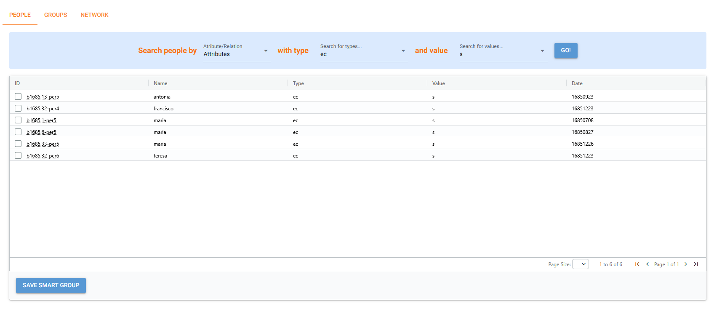

# Web App Roadmap

These are the features that are to be implemented on the Web App in the future:

## Login 

Logging in with Google Authentication should also be implemented, similar to how Github implementation works currently.

## People Page

There is already a page where users can search for people with specific attributes:

An additional feature yet to be implemented is selecting people to then save to a "**smart group**" which would then be visible in the "**Groups**" tab of the web page. Groups should be searchable and editable.

Finally, **Networks** of people should also be created and displayed according to functions provided by the Kleio Server, such as `network_from_rels` and `network_from_functions`.

## Families

Families, genealogies and demographics should be featured in this page, with the ability to search/list complete families, review family records, view ascendancy and descendancy, and display demographic information (mean age of marriage, natality and mortality, etc...), among others.

## Calendar

Display an explorable calendar with festivities appropriately marked. This calendar should display dates on attributes and relations, as well as cronologies.

## Other Details

- Branding customization and themes;
- Real Person View;
- On the [sources page](sources_page.md), it should be possible for the user to interact directly with a repository linked with the project for easier management of different projects and database.