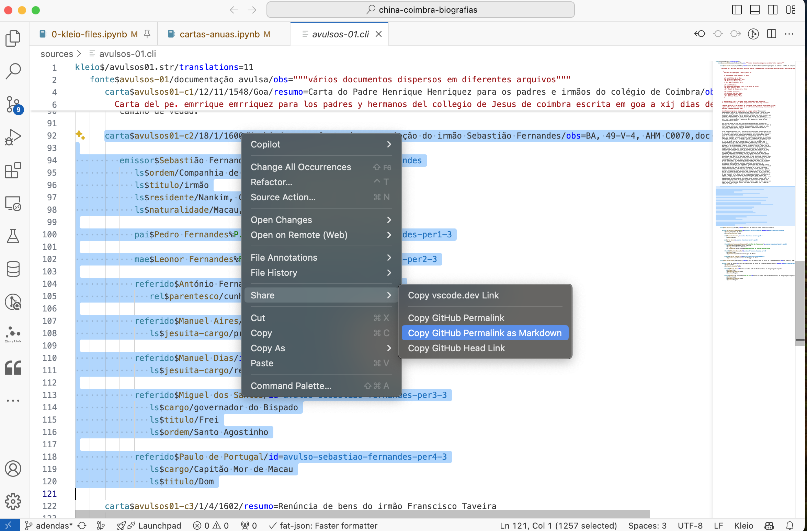

You can generate a link to a fragment of a source in VSCode, by selecting the lines in the source and right clicking on the selection and choosing the "Share" menu item.

The "Head Link" will point to the most recent version of the file. The permalink is the current version. By copying as Markdown you get a fragment that can be pasted in a Markdown text, such as this note:

- [carta$avulsos01-c2/18/1/1600/Nankin/resumo=Carta de renunciação do irmão Sebastião Fernandes/obs=BA, 49-V-4, AHM C0070,doc 8, fol. 5v](https://github.com/joaquimrcarvalho/china-coimbra-biografias/blob/c9dd4018941432302e531bc96dd030005370984f/sources/avulsos-01.cli#L92-L121)
